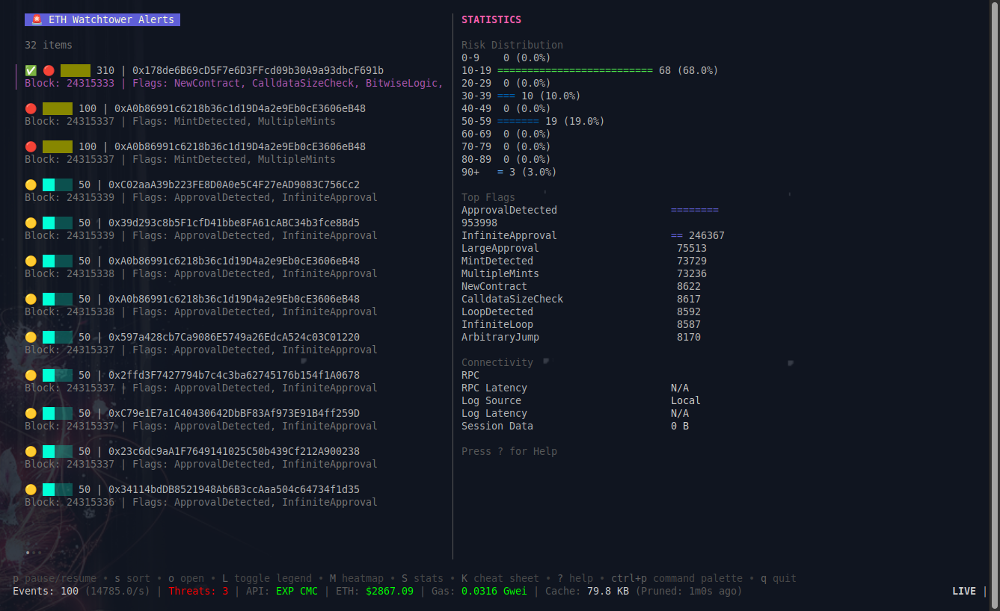
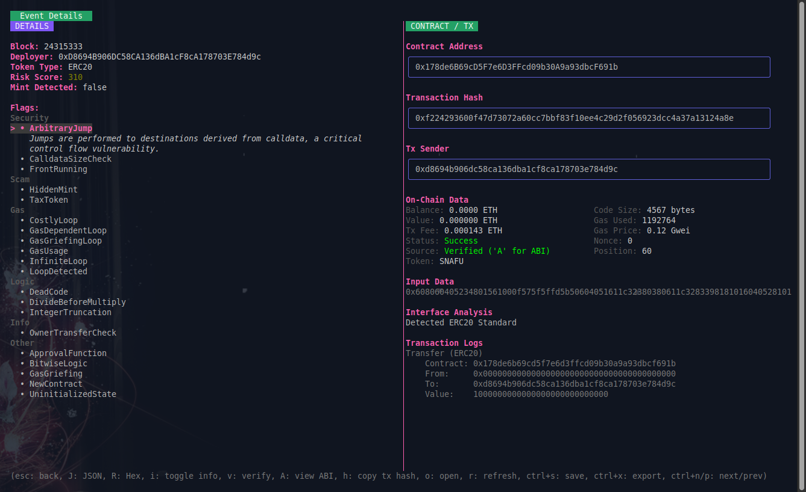
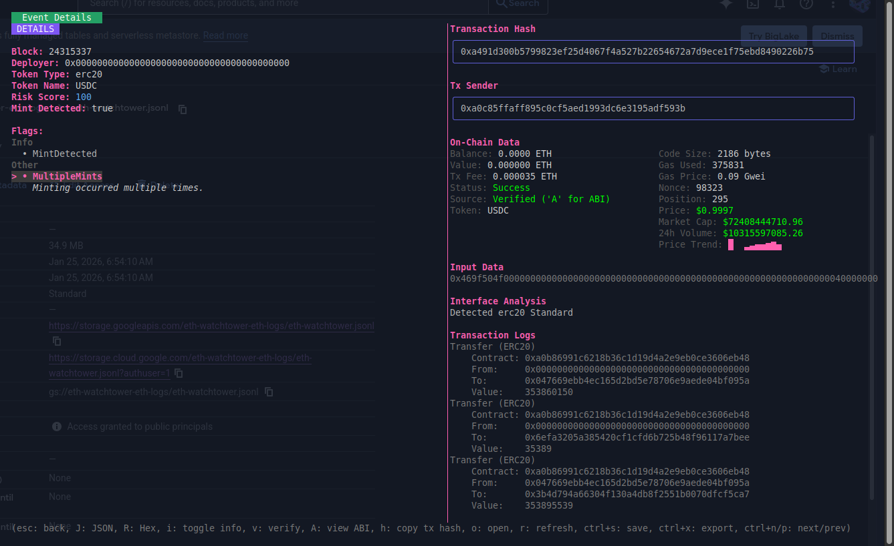
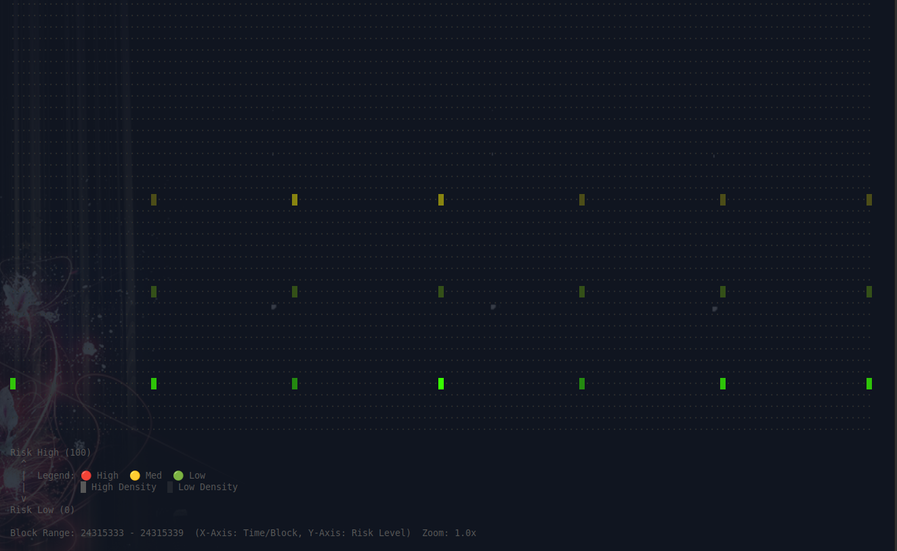
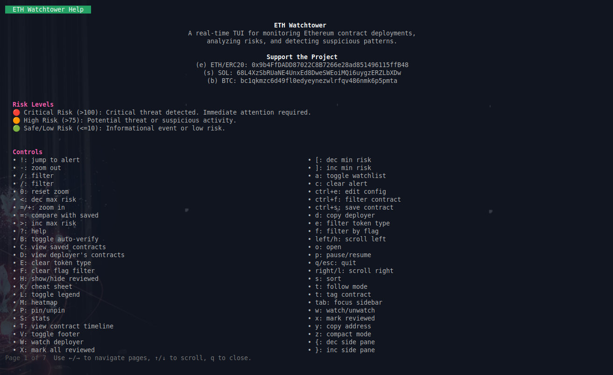
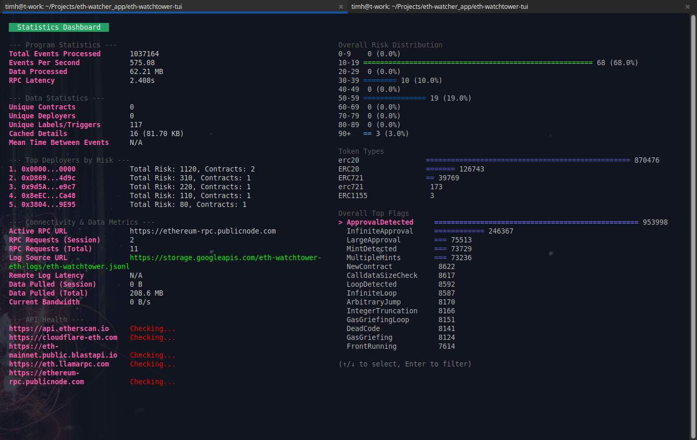

# ETH Watchtower 🛡️

**Real-time Scam Contract Detection on EVM Chains.**

ETH Watchtower provides a live data stream to find and flag weird and scammy contracts in real-time, protecting the ecosystem from malicious actors.

## ✨ Features

- **Real-time Data Stream:** Our system continuously monitors EVM chains for suspicious contract deployments and interactions, providing you with up-to-the-second threat intelligence.
- **Full Details Available:** Get full details about the contract including source code or ABI, as well as categorized alerts.
- **Save Events for Later:** Easily save and bookmark events for later comparison, spot serial deployers and contract factories as well as rugpulls directly.

## ⚙️ How It Works

1.  **Mempool & Blockchain Scanning:** Our distributed network of nodes connects directly to EVM-compatible chains, scanning the mempool for pending transactions and analyzing newly mined blocks in real-time.
2.  **Bytecode & Heuristic Analysis:** Each new contract's bytecode is analyzed against a vast library of known scam patterns, vulnerabilities, and malicious functions.
3.  **AI-Powered Threat Modeling:** We leverage a proprietary machine learning model to identify novel threats and sophisticated scams by recognizing subtle patterns.
4.  **Real-time Scoring & Alerting:** Contracts are assigned a dynamic risk score. High-risk events are immediately flagged and pushed to our data stream.

## 📸 Gallery

*A glimpse into the ETH Watchtower terminal user interface.*

| | |
|:-------------------------:|:-------------------------:|
| *List View: Overview of monitored contracts* |  *Details View: In-depth contract information*|
| *Details View: multi-layered transaction history* |  *ABI when available*|
| *Heatmap: Visualizing contract interaction patterns* |  *Comprehensive help*|
| *Easy to use and familiar Ctrl+P command palette* |  *Statistics*|

## 🤝 Sponsorship and Support

ETH Watchtower is a sponsored tool. The data stream is free for now. Please email **contact@ethwatchtower.xyz** for full access to source code, updates, and binaries.

You can also support the project through donations:
- **ETH/ERC20:** `0x9b4FfDADD87022C8B7266e28ad851496115ffB48`
- **SOL:** `68L4XzSbRUaNE4UnxEd8DweSWEoiMQi6uygzERZLbXDw`
- **BTC:** `bc1qkmzc6d49fl0edyeynezwlrfqv486nmk6p5pmta`

## 🚀 Live Site

View the project live here: https://rnts08.github.io/eth-watchtower-tui/